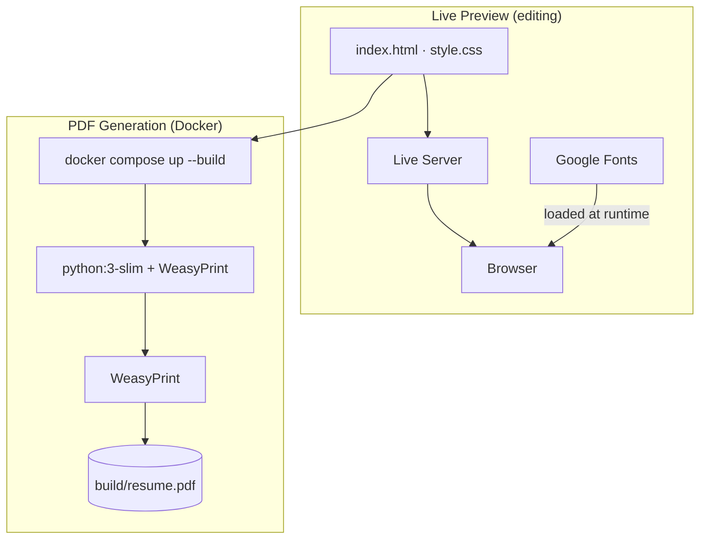

# HTML Resume

A print-ready HTML/CSS resume that uses [WeasyPrint](https://weasyprint.org/) inside Docker to generate a PDF. Running the container outputs `resume.pdf` into a local `build/` folder.

## Prerequisites

- [Docker](https://docs.docker.com/engine/install/)
- [Docker Compose](https://docs.docker.com/compose/install/)

**Arch Linux quick install:**
```bash
sudo pacman -S docker docker-compose
sudo systemctl enable --now docker
sudo usermod -aG docker $USER
newgrp docker
```

## Usage

### Live preview (while editing)

Install the [Live Server](https://marketplace.visualstudio.com/items?itemName=ritwickdey.LiveServer) extension in VSCode. Then right-click `index.html` and choose **Open with Live Server**. The browser will auto-reload on every save.

### Generate PDF

```bash
docker compose up --build
```

The PDF will be written to `./build/resume.pdf`. The `build/` folder is created automatically if it does not exist.

## How it works

The container runs WeasyPrint against `index.html`, mounts the host `./build` directory, and exits after writing the PDF. No browser visit required.



## TODO

- [ ] **Separate content from markup** — Move all resume data (jobs, skills, contact info) into a `resume.json` or `resume.yaml` file and use a Jinja2 template to render the HTML. Users edit only the data file, never the HTML directly.
- [ ] **CI/CD with GitHub Actions** — On every push to `main`, run the Docker container and attach the generated `resume.pdf` as a release artifact so the latest PDF is always available without running anything locally.
- [ ] **Tailored resume variants** — Once content is in a data file, support multiple variants (e.g. `resume-embedded.yaml`, `resume-fullstack.yaml`) for targeting different roles. One `docker compose up` generates all of them.
- [ ] **PDF hot-reload watcher** — Add a `watch` service to `docker-compose.yml` that monitors `index.html` and `style.css` for changes and re-runs WeasyPrint automatically.
- [ ] **Self-hosted fonts** — Bundle the Cormorant Garamond and Geist Sans font files in the repo so the container has no internet dependency and PDF output is guaranteed to match the browser preview.
- [ ] **Content validation** — Add a pre-build step that validates the data file against a schema (required fields present, dates formatted correctly, bullet points under a character limit).

## Project Structure

```
.
├── index.html          # Resume content
├── style.css           # Styles and print stylesheet
├── Dockerfile          # python:3-slim + WeasyPrint
├── docker-compose.yml  # Mounts ./build for PDF output
└── build/              # Generated — resume.pdf appears here
```
