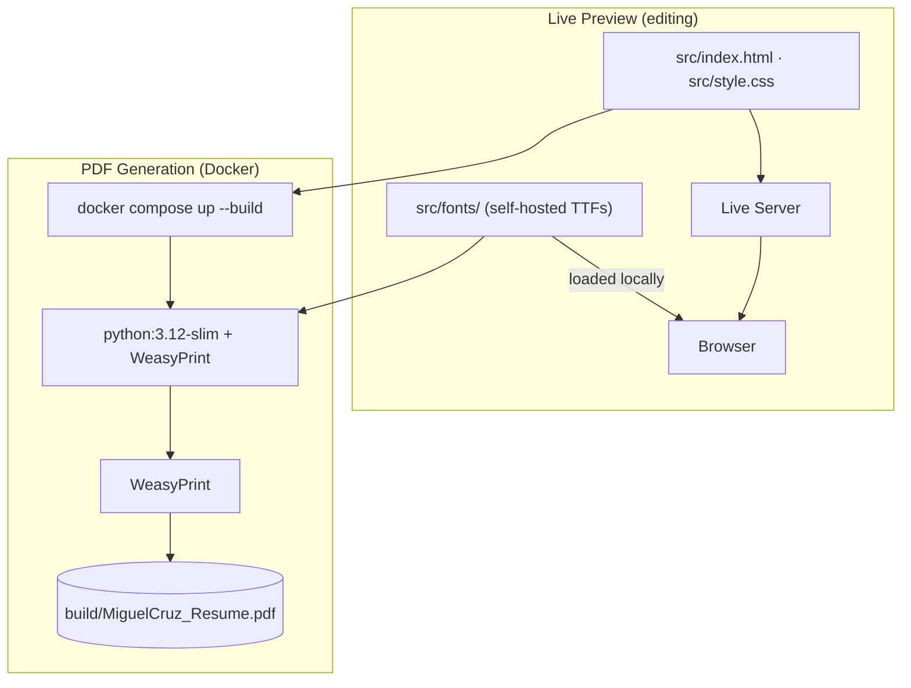

# HTML Resume

A print-ready HTML/CSS resume that uses [WeasyPrint](https://weasyprint.org/) inside Docker to generate a PDF. Running the container outputs `resume.pdf` into a local `build/` folder.

## Prerequisites

- Docker + Docker Compose

**Arch Linux:**
```bash
sudo pacman -S docker docker-compose
sudo systemctl enable --now docker
sudo usermod -aG docker $USER
newgrp docker
```

**macOS** — uses [Homebrew](https://brew.sh/) and [Colima](https://github.com/abiosoft/colima) as the Docker runtime:
```bash
brew install colima docker docker-compose
colima start          # starts the Docker daemon (run this each session, or add to login items)
```

**Windows** — install Docker Engine inside WSL 2 (run in PowerShell as Administrator, then inside the WSL terminal):
```powershell
# 1. Enable WSL 2
wsl --install         # installs Ubuntu by default, then restart
```
```bash
# 2. Inside the WSL terminal — install Docker Engine
sudo apt-get update && sudo apt-get install -y ca-certificates curl
sudo install -m 0755 -d /etc/apt/keyrings
sudo curl -fsSL https://download.docker.com/linux/ubuntu/gpg -o /etc/apt/keyrings/docker.asc
sudo chmod a+r /etc/apt/keyrings/docker.asc
echo "deb [arch=$(dpkg --print-architecture) signed-by=/etc/apt/keyrings/docker.asc] \
  https://download.docker.com/linux/ubuntu $(. /etc/os-release && echo "$VERSION_CODENAME") stable" \
  | sudo tee /etc/apt/sources.list.d/docker.list > /dev/null
sudo apt-get update
sudo apt-get install -y docker-ce docker-ce-cli containerd.io docker-buildx-plugin docker-compose-plugin
sudo service docker start
sudo usermod -aG docker $USER && newgrp docker
```

## Usage

### Live preview (while editing)

Install the [Live Server](https://marketplace.visualstudio.com/items?itemName=ritwickdey.LiveServer) extension in VSCode. Then right-click `src/index.html` and choose **Open with Live Server**. The browser will auto-reload on every save.

### Generate PDF

```bash
docker compose up --build
```

The PDF will be written to `./build/resume.pdf`. The `build/` folder is created automatically if it does not exist.

## How it works

The container runs WeasyPrint against `index.html`, mounts the host `./build` directory, and exits after writing the PDF. No browser visit required.



## TODO

- [ ] **Separate content from markup** — Move all resume data (jobs, skills, contact info) into a `resume.json` or `resume.yaml` file and use a Jinja2 template to render the HTML. Users edit only the data file, never the HTML directly.
- [x] **CI/CD with GitHub Actions** — On every push to `main`, run the Docker container and attach the generated `resume.pdf` as a release artifact so the latest PDF is always available without running anything locally.
- [ ] **Tailored resume variants** — Once content is in a data file, support multiple variants (e.g. `resume-embedded.yaml`, `resume-fullstack.yaml`) for targeting different roles. One `docker compose up` generates all of them.
- [ ] **PDF hot-reload watcher** — Add a `watch` service to `docker-compose.yml` that monitors `index.html` and `style.css` for changes and re-runs WeasyPrint automatically.
- [x] **Self-hosted fonts** — Geist Sans and Cormorant Garamond TTF files are bundled in `src/fonts/` and loaded via `@font-face`. No internet dependency at runtime — PDF output matches the browser preview.
- [ ] **Content validation** — Add a pre-build step that validates the data file against a schema (required fields present, dates formatted correctly, bullet points under a character limit).

## Project Structure

```
.
├── src/
│   ├── index.html              # Resume content
│   ├── style.css               # Styles and print stylesheet
│   └── fonts/
│       ├── geist-sans/         # Geist Sans TTFs (300, 300i, 400, 500)
│       └── cormorant-garamond/ # Cormorant Garamond TTFs (400)
├── Dockerfile                  # python:3.12-slim + WeasyPrint
├── docker-compose.yml          # Mounts ./build for PDF output
└── build/                      # Generated — MiguelCruz_Resume.pdf appears here
```
