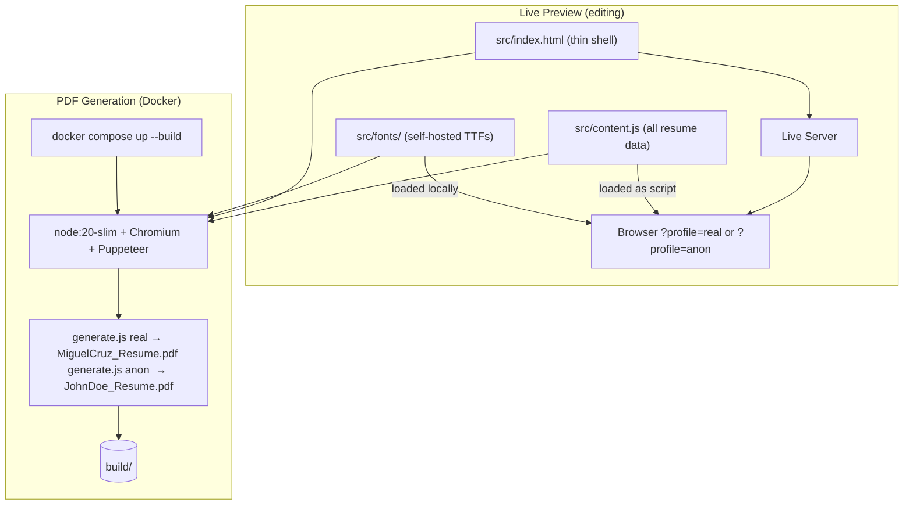

# HTML Resume

A print-ready HTML/CSS resume. All content lives in `src/content.js` — edit bullet points, jobs, and contact info there, never in the HTML. Chrome headless (via Puppeteer) generates the PDFs so the browser live preview and the PDF output use the exact same rendering engine.

Two PDF variants are produced:
- **`MiguelCruz_Resume.pdf`** — full personal details
- **`JohnDoe_Resume.pdf`** — anonymized version with company names, location, and identifying info scrubbed

## Prerequisites

- Docker + Docker Compose

**Arch Linux:**
```bash
sudo pacman -S docker docker-compose
sudo systemctl enable --now docker
sudo usermod -aG docker $USER
newgrp docker
```

**macOS** — uses [Homebrew](https://brew.sh/) and [Colima](https://github.com/abiosoft/colima) as the Docker runtime:
```bash
brew install colima docker docker-compose
colima start          # starts the Docker daemon (run this each session, or add to login items)
```

**Windows** — install Docker Engine inside WSL 2 (run in PowerShell as Administrator, then inside the WSL terminal):
```powershell
# 1. Enable WSL 2
wsl --install         # installs Ubuntu by default, then restart
```
```bash
# 2. Inside the WSL terminal — install Docker Engine
sudo apt-get update && sudo apt-get install -y ca-certificates curl
sudo install -m 0755 -d /etc/apt/keyrings
sudo curl -fsSL https://download.docker.com/linux/ubuntu/gpg -o /etc/apt/keyrings/docker.asc
sudo chmod a+r /etc/apt/keyrings/docker.asc
echo "deb [arch=$(dpkg --print-architecture) signed-by=/etc/apt/keyrings/docker.asc] \
  https://download.docker.com/linux/ubuntu $(. /etc/os-release && echo "$VERSION_CODENAME") stable" \
  | sudo tee /etc/apt/sources.list.d/docker.list > /dev/null
sudo apt-get update
sudo apt-get install -y docker-ce docker-ce-cli containerd.io docker-buildx-plugin docker-compose-plugin
sudo service docker start
sudo usermod -aG docker $USER && newgrp docker
```

## Usage

### Live preview (while editing)

Install the [Live Server](https://marketplace.visualstudio.com/items?itemName=ritwickdey.LiveServer) extension in VSCode. Then right-click `src/index.html` and choose **Open with Live Server**.

- `src/index.html` — real profile (default)
- `src/index.html?profile=anon` — anonymized profile

The browser will auto-reload on every save.

### Generate PDFs

```bash
docker compose up --build
```

Both PDFs will be written to `./build/`. The `build/` folder is created automatically if it does not exist.

## How it works

All resume data is defined in `src/content.js` as a `profiles` object. `profiles.real` holds the full content. `profiles.anon` spreads over `real` and overrides only personal fields — company names, contact info, location, and education details. Bullet points that mention identifying names have a separate `anonBullets` field on that entry.

`src/index.html` is a thin shell with empty containers. An inline script reads the `?profile=` URL param and calls `populate()` to fill in the page at load time. This means the live browser preview and the PDF share the same JS rendering path.

`generate.js` launches Chromium via Puppeteer, loads the page as a `file://` URL, and calls `page.pdf()` with zero page margins — all spacing is handled by the CSS `.page` padding so the full-bleed header renders correctly.


```mermaid
flowchart TD
    content["src/content.js (all resume data)"]
    html["src/index.html (thin shell)"]
    fonts["src/fonts/ (self-hosted TTFs)"]

    subgraph preview["Live Preview (editing)"]
        LS["Live Server"]
        BR["Browser ?profile=real or ?profile=anon"]
        html --> LS --> BR
        content -->|loaded as script| BR
        fonts -->|loaded locally| BR
    end

    subgraph docker["PDF Generation (Docker)"]
        DC["docker compose up --build"]
        IMG["node:20-slim + Chromium + Puppeteer"]
        GEN["generate.js real → MiguelCruz_Resume.pdf generate.js anon  → JohnDoe_Resume.pdf"]
        VOL[("build/")]
        DC --> IMG --> GEN --> VOL
        content --> IMG
        html --> IMG
        fonts --> IMG
    end
```

## Editing content

Open `src/content.js`. All jobs, bullets, skills, contact info, and education are defined there.

To scrub a field in the anon version, add it to the `profiles.anon` override at the bottom of the file. Bullet points that reference identifying names get an `anonBullets` array on the entry — the anon profile picks those up automatically and falls back to `bullets` for entries that don't need changes.

## Project Structure

```
.
├── src/
│   ├── index.html              # Thin shell — no inline content
│   ├── content.js              # All resume data: real + anon profiles
│   ├── style.css               # Styles and print stylesheet
│   └── fonts/
│       ├── geist-sans/         # Geist Sans TTFs (300, 300i, 400, 500)
│       └── cormorant-garamond/ # Cormorant Garamond TTFs (400)
├── generate.js                 # Puppeteer PDF generation script
├── Dockerfile                  # node:20-slim + Chromium + puppeteer-core
├── docker-compose.yml          # Two services: resume-real and resume-anon
└── build/                      # Generated — PDFs appear here
```

## TODO

- [x] **Separate content from markup** — All resume data lives in `src/content.js`. Edit bullet points and jobs there, never in the HTML.
- [x] **CI/CD with GitHub Actions** — On every push to `main`, both PDFs are generated and attached as release artifacts.
- [x] **Anonymized resume variant** — `JohnDoe_Resume.pdf` is generated automatically with company names, location, education details, and contact info scrubbed.
- [x] **Self-hosted fonts** — Geist Sans and Cormorant Garamond TTF files are bundled in `src/fonts/` and loaded via `@font-face`. No internet dependency at runtime.
- [ ] **PDF hot-reload watcher** — Add a `watch` service to `docker-compose.yml` that monitors source files and regenerates the PDF automatically.
- [ ] **Content validation** — Add a pre-build step that validates the data against a schema (required fields present, dates formatted correctly, bullet points under a character limit).
