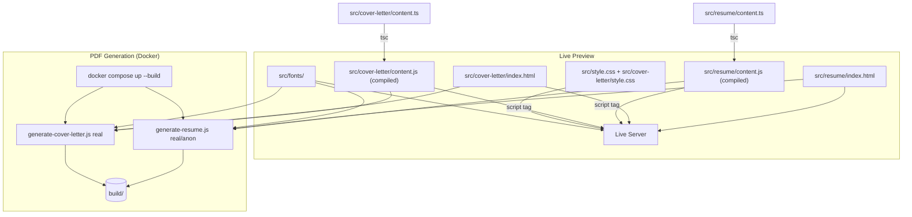

# HTML Resume + Cover Letter

A print-ready HTML/CSS resume and cover letter written in TypeScript. All content lives in typed TypeScript files — edit bullet points, jobs, contact info, and letter text there, never in the HTML. Chrome headless (via Puppeteer) generates the PDFs so the browser live preview and the PDF output use the exact same rendering engine.

PDFs produced:
- **`MiguelCruz_Resume.pdf`** — full personal details
- **`JohnDoe_Resume.pdf`** — anonymized version with company names, location, and identifying info scrubbed
- **`MiguelCruz_CoverLetter.pdf`** — cover letter (local build only, not published to releases)

## Prerequisites

- Docker + Docker Compose

**Arch Linux:**
```bash
sudo pacman -S docker docker-compose
sudo systemctl enable --now docker
sudo usermod -aG docker $USER
newgrp docker
```

**macOS** — uses [Homebrew](https://brew.sh/) and [Colima](https://github.com/abiosoft/colima) as the Docker runtime:
```bash
brew install colima docker docker-compose
colima start          # starts the Docker daemon (run this each session, or add to login items)
```

**Windows** — install Docker Engine inside WSL 2 (run in PowerShell as Administrator, then inside the WSL terminal):
```powershell
# 1. Enable WSL 2
wsl --install         # installs Ubuntu by default, then restart
```
```bash
# 2. Inside the WSL terminal — install Docker Engine
sudo apt-get update && sudo apt-get install -y ca-certificates curl
sudo install -m 0755 -d /etc/apt/keyrings
sudo curl -fsSL https://download.docker.com/linux/ubuntu/gpg -o /etc/apt/keyrings/docker.asc
sudo chmod a+r /etc/apt/keyrings/docker.asc
echo "deb [arch=$(dpkg --print-architecture) signed-by=/etc/apt/keyrings/docker.asc] \
  https://download.docker.com/linux/ubuntu $(. /etc/os-release && echo "$VERSION_CODENAME") stable" \
  | sudo tee /etc/apt/sources.list.d/docker.list > /dev/null
sudo apt-get update
sudo apt-get install -y docker-ce docker-ce-cli containerd.io docker-buildx-plugin docker-compose-plugin
sudo service docker start
sudo usermod -aG docker $USER && newgrp docker
```

## Usage

### Live preview (while editing)

Install the [Live Server](https://marketplace.visualstudio.com/items?itemName=ritwickdey.LiveServer) extension in VSCode.

Start the TypeScript watcher (runs inside Docker — no local Node/npm required):

```bash
docker compose --profile dev up --build tsc-watch
```

The `--build` flag ensures the image is rebuilt with the current `tsconfig.json`. This mounts `./src/` into the container and recompiles the content files on every save, writing the compiled `.js` files back to your local filesystem. Leave it running in a terminal, then right-click the desired HTML file and choose **Open with Live Server**.

| File | Preview |
|---|---|
| `src/resume/index.html` | Resume — real profile (default) |
| `src/resume/index.html?profile=anon` | Resume — anonymized |
| `src/cover-letter/index.html` | Cover letter |

If you do have npm installed locally, `npm install && npm run watch` works too.

### Generate PDFs

```bash
docker compose up --build
```

PDFs will be written to `./build/`. Resume PDFs (`real` + `anon`) and the cover letter are all generated. The `build/` folder is created automatically if it does not exist.

## How it works

Resume data is defined in `src/resume/content.ts` as a typed `profiles` object. `profiles.real` holds the full content. `profiles.anon` spreads over `real` and overrides only personal fields — company names, contact info, location, and education details. Bullet points that mention identifying names have a separate `anonBullets` field on that entry.

Cover letter data is defined in `src/cover-letter/content.ts` as a `coverLetterProfiles` object. Edit recipient details, body paragraphs, and the date there.

Both `index.html` files are thin shells with empty containers. An inline script reads the `?profile=` URL param and calls `populate()` to fill the page at load time. The live browser preview and the PDF share the same JS rendering path.

`generate-resume.ts` and `generate-cover-letter.ts` each launch Chromium via Puppeteer, load the respective page as a `file://` URL, and call `page.pdf()` with zero page margins — all spacing is handled by the CSS `.page` padding so the full-bleed header renders correctly. `tsc` compiles all `.ts` files to `.js` before anything runs.


```mermaid
flowchart TD
    resumets["src/resume/content.ts"]
    resumejs["src/resume/content.js (compiled)"]
    resumehtml["src/resume/index.html"]
    clts["src/cover-letter/content.ts"]
    cljs["src/cover-letter/content.js (compiled)"]
    clhtml["src/cover-letter/index.html"]
    css["src/style.css + src/cover-letter/style.css"]
    fonts["src/fonts/"]

    resumets -->|tsc| resumejs
    clts -->|tsc| cljs

    subgraph preview["Live Preview"]
        LS["Live Server"]
        resumehtml --> LS
        clhtml --> LS
        resumejs -->|script tag| LS
        cljs -->|script tag| LS
        css --> LS
        fonts --> LS
    end

    subgraph docker["PDF Generation (Docker)"]
        DC["docker compose up --build"]
        GR["generate-resume.js real/anon"]
        GC["generate-cover-letter.js real"]
        VOL[("build/")]
        DC --> GR --> VOL
        DC --> GC --> VOL
        resumejs --> GR
        cljs --> GC
        resumehtml --> GR
        clhtml --> GC
        fonts --> GR
        fonts --> GC
    end
```

## Editing content

### Resume
Open `src/resume/content.ts`. All jobs, bullets, skills, contact info, and education are defined there as typed TypeScript objects.

To scrub a field in the anon version, add it to the `profiles.anon` override at the bottom of the file. Bullet points that reference identifying names get an `anonBullets` array on the entry — the anon profile picks those up automatically.

### Cover letter
Open `src/cover-letter/content.ts`. Update `date`, `recipient` fields (company, address, location, phone, email), `greeting`, `paragraphs`, and `closing`. The `name`, `contact`, and `footer` fields are kept in sync with the resume manually.

## Project Structure

```
.
├── src/
│   ├── style.css                   # Shared styles and print stylesheet
│   ├── fonts/
│   │   ├── geist-sans/             # Geist Sans TTFs (300, 300i, 400, 500)
│   │   └── cormorant-garamond/     # Cormorant Garamond TTF (400)
│   ├── resume/
│   │   ├── content.ts              # Resume data: real + anon profiles (TypeScript source)
│   │   ├── content.js              # Compiled — generated by tsc, loaded by browser
│   │   └── index.html              # Thin shell — no inline content
│   └── cover-letter/
│       ├── content.ts              # Cover letter data (TypeScript source)
│       ├── content.js              # Compiled — generated by tsc, loaded by browser
│       ├── index.html              # Thin shell — no inline content
│       └── style.css               # Cover letter body styles (extends shared style.css)
├── generate-resume.ts              # Puppeteer script for resume PDFs (TypeScript source)
├── generate-resume.js              # Compiled — generated by tsc, run by Docker
├── generate-cover-letter.ts        # Puppeteer script for cover letter PDF (TypeScript source)
├── generate-cover-letter.js        # Compiled — generated by tsc, run by Docker
├── package.json                    # Node deps: puppeteer-core, typescript, @types/node
├── tsconfig.json                   # TypeScript config
├── Dockerfile                      # node:20-slim + Chromium; builds TS then runs generate-resume.js
├── docker-compose.yml              # Services: resume-real, resume-anon, cover-letter-real, tsc-watch (dev)
└── build/                          # Generated — PDFs appear here
```

## TODO

- [x] **Separate content from markup** — All data lives in typed TypeScript files, never in the HTML.
- [x] **CI/CD with GitHub Actions** — On every push to `main`, resume PDFs are generated and attached as release artifacts.
- [x] **Anonymized resume variant** — `JohnDoe_Resume.pdf` is generated automatically with identifying info scrubbed.
- [x] **Self-hosted fonts** — Geist Sans and Cormorant Garamond TTF files are bundled in `src/fonts/`. No internet dependency at runtime.
- [x] **TypeScript** — All source files are fully typed with strict mode. `tsc` compiles to `.js` in-place.
- [x] **Cover letter** — Matching header/footer styling, two-column layout with contact + recipient sidebar.
- [ ] **PDF hot-reload watcher** — Add a `watch` service to `docker-compose.yml` that monitors source files and regenerates the PDFs automatically.
- [ ] **Content validation** — Pre-build check that validates the data against the TypeScript interfaces (required fields present, dates formatted correctly, bullet points under a character limit).
